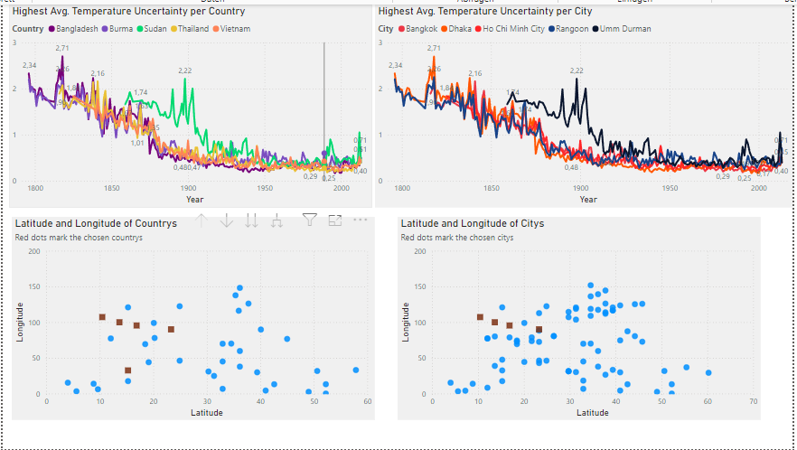

# Global Temperatures Analysis

## Projektübersicht
Dieses Projekt analysiert globale Temperaturtrends über vier Jahrhunderte. Die Daten stammen von Kaggle und wurden in Azure Blob Storage hochgeladen. Anschließend wurden sie mit einer Azure SQL-Datenbank verarbeitet und in Power BI analysiert.

## Dateien und Struktur
- **`src/sql_queries/query.sql`**: SQL-Abfrage für die Datenverarbeitung.
- **`assets/powerbi/analysis.pbix`**: Power BI-Datei mit der Analyse.
- **`assets/screenshots/`**: Visualisierungen aus Power BI.

## Analyse-Schritte
1. **Datenquelle**: Kaggle-Datensatz zu globalen Temperaturen ([[Link](https://www.kaggle.com)](https://www.kaggle.com/datasets/maso0dahmed/global-temperature-records-1850-2022)).
2. **Datenverarbeitung**:
   - Upload in Azure Blob Storage.
   - Verknüpfung mit einer Azure SQL-Datenbank.
3. **Analyse**:
   - Mit Power BI wurden Temperaturtrends und Abweichungen analysiert.

## Ergebnisse

### Regionale Temperaturabweichungen

## Reproduzieren
1. Lade den Kaggle-Datensatz herunter.
2. Lade die Daten in Azure Blob Storage hoch.
3. Verwende die SQL-Abfrage in `query.sql`, um die Daten zu verarbeiten.
4. Öffne die Datei `analysis.pbix` in Power BI, um die Analyse zu reproduzieren.
